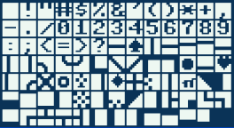
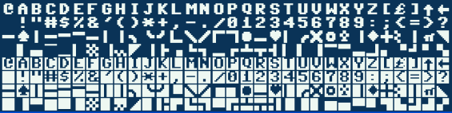
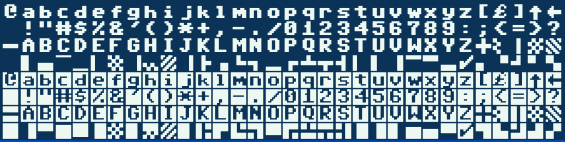
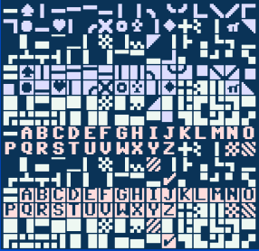
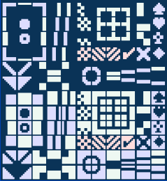

# PETSCII
### Sublime Text Plugin for PETSCII Unicode

Use this in conjunction with [C64Tools](//github.com/thinkyhead/6502-Tools/tree/work-commodore-64/Sublime/C64Tools) to edit Commodore BASIC the modern way. Requires [Pet Me](https://www.kreativekorp.com/software/fonts/c64/) Font.

#### Insert Characters

Press <kbd>Ctrl+Shift+C</kbd> <kbd>Ctrl+Shift+C</kbd> to open popup panel with PETSCII Inverted Characters. Click to insert characters. To close the panel press ESC or click outside the panel.

Press <kbd>Ctrl+Shift+C</kbd> <kbd>Ctrl+Shift+1</kbd> to open popup panel with PETSCII Unshifted Characters. Click to insert characters. To close the panel press ESC or click outside the panel.

Press <kbd>Ctrl+Shift+C</kbd> <kbd>Ctrl+Shift+2</kbd> to open popup panel with PETSCII Shifted Characters. Click to insert characters. To close the panel press ESC or click outside the panel.

Press <kbd>Ctrl+Shift+C</kbd> <kbd>Ctrl+Shift+S</kbd> to open popup panel with PETSCII Special Characters. Click to insert characters. To close the panel press ESC or click outside the panel.

Press <kbd>Ctrl+Shift+C</kbd> <kbd>Ctrl+Shift+D</kbd> to open popup panel with PETSCII Draw Characters. Click to insert characters. To close the panel press ESC or click outside the panel.

#### Invert Selected Text

Press <kbd>Ctrl+Shift+C</kbd> <kbd>Ctrl+Shift+I</kbd> to invert the selected text, replacing all normal characters with inverted characters and _vice-versa_.
